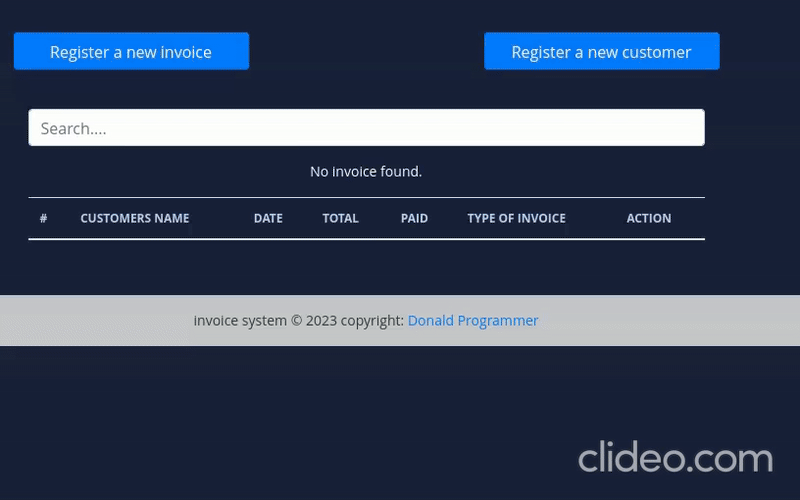

# django-invoice system
J'ai suivi un tutoriel consistant à déployer une application Django.
Cette application permet de récupérer les informations des utilisateurs et les ajoute à une base de données PostgreSQL.
Une instance EC2 d'AWS est lancée, connectée par SSH à VS Code et GitHub.

Source : https://github.com/donaldte/django-invoice

# Steps
git clone https://github.com/donaldte/django-invoice.git

cd django-invoice

python3.9 -m venv venv

source venv/bin/activate

pip install -r requirements.txt

python manage.py runserver 
